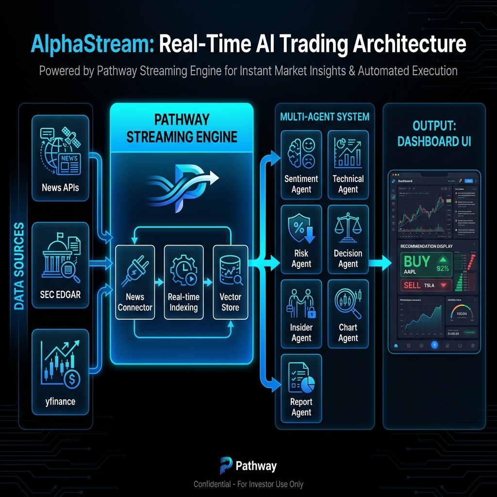
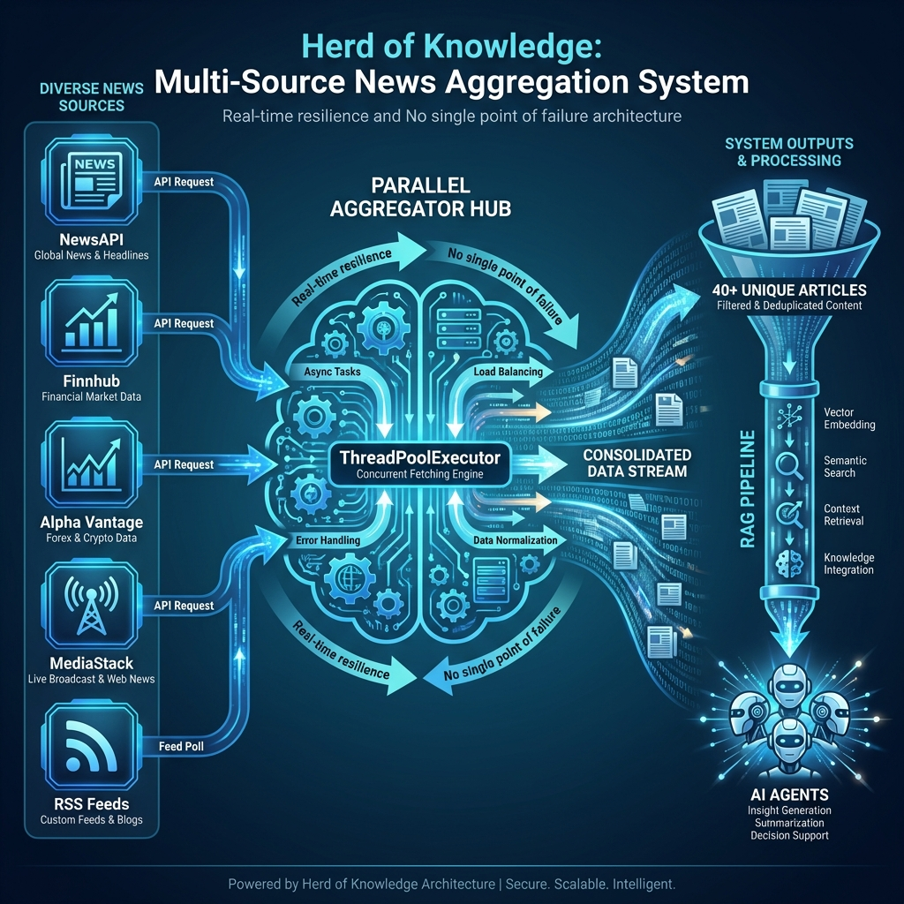

# AlphaStream Live AI

**Real-Time Financial Intelligence Powered by Pathway Streaming Engine**

AlphaStream is a production-grade AI trading system that solves the "stale knowledge" problem in financial analysis. It combines **real-time news ingestion**, **SEC EDGAR filings**, **multi-agent reasoning**, and **live visualization** to deliver instant, explainable trading recommendations.

Built for **DataQuest 2026** hackathon using the [Pathway](https://pathway.com/) streaming framework.

---

## 🎯 Problem Statement

Traditional AI systems suffer from knowledge cutoff—they can't react to breaking news or regulatory filings. AlphaStream demonstrates **Live AI**:
- Ingests news articles in real-time
- Updates recommendations in **<2 seconds** when new data arrives
- Incorporates SEC insider trading data
- Generates professional PDF reports

---

## 🚀 Key Features

### Real-Time Data Pipeline
- **Pathway Streaming Engine** - Incremental processing, no batch jobs
- **NewsAPI Integration** - Live financial news polling
- **SEC EDGAR Connector** - Form 4 insider trading filings

### Multi-Agent Reasoning System
| Agent | Function |
|-------|----------|
| **Sentiment Agent** | LLM-powered news sentiment analysis |
| **Technical Agent** | RSI, SMA calculations from yfinance |
| **Risk Agent** | Volatility-based position sizing |
| **Insider Agent** | SEC Form 4 transaction analysis |
| **Chart Agent** | 7-day price charts with 24h highlighting |
| **Report Agent** | PDF generation with charts & tables |
| **Decision Agent** | Final BUY/HOLD/SELL recommendation |

### Bloomberg-Style Dashboard
- Real-time sentiment heatmap
- Agent consensus radar chart
- Insider activity panel
- One-click PDF report generation

---

## 🛠️ Technology Stack

| Layer | Technology |
|-------|------------|
| **Streaming Engine** | Pathway |
| **Backend** | FastAPI, Python 3.11 |
| **LLM** | LangChain, OpenRouter (Claude/Gemma) |
| **Market Data** | yfinance, edgartools |
| **PDF Reports** | ReportLab, Matplotlib |
| **Frontend** | React 18, Vite, Tailwind CSS, Shadcn |
| **State** | Zustand |

### Pathway xpacks.llm Integration

We use **Pathway's official LLM xpack** (from [llm-app templates](https://github.com/pathwaycom/llm-app/tree/main/templates/adaptive_rag)) for maximum performance:

| Component | Pathway xpack Class |
|-----------|-------------------|
| **Adaptive RAG** | `pw.xpacks.llm.question_answering.AdaptiveRAGQuestionAnswerer` |
| **Document Store** | `pw.xpacks.llm.document_store.DocumentStore` |
| **LLM Chat** | `pw.xpacks.llm.llms.OpenAIChat` |
| **Embeddings** | `pw.xpacks.llm.embedders.OpenAIEmbedder` |
| **Splitter** | `pw.xpacks.llm.splitters.TokenCountSplitter` |
| **Vector Search** | `pw.indexing.UsearchKnnFactory` |
| **REST Server** | `pw.xpacks.llm.servers.QASummaryRestServer` |

**Adaptive RAG** uses a geometric retrieval strategy - starting with 2 documents and expanding only when the LLM needs more context, saving tokens without sacrificing accuracy.

---

## ⚡ Quick Start

### Prerequisites
- Python 3.11+
- Node.js 18+
- API Keys: OpenRouter, NewsAPI

### 1. Clone & Setup
```bash
cd "AlphaStream"

# Install Python dependencies (using uv)
cd backend && uv sync && cd ..

# Install frontend dependencies
cd frontend && npm install && cd ..
```

### 2. Configure Environment
```bash
# Backend environment (required)
cd backend
cp .env.example .env
# Edit .env with your API keys:
# - OPENROUTER_API_KEY (required - LLM access)
# - NEWS_API_KEY (required - NewsAPI)
# - FINNHUB_API_KEY (optional - additional news)
# - ALPHAVANTAGE_API_KEY (optional - sentiment data)
# - MEDIASTACK_API_KEY (optional - global news)
cd ..
```

### 3. Run the System

**Option A: Single Command (Recommended)**
```bash
cd backend
./start.sh
```
This starts both Adaptive RAG and the main backend in the correct order.

**Option B: Separate Terminals (for debugging)**

*Terminal 1: Adaptive RAG Server*
```bash
cd backend
uv run python -m src.pipeline.adaptive_rag_server
```

*Terminal 2: Backend*
```bash
cd backend
uv run uvicorn src.api.app:app --host 0.0.0.0 --port 8000
```

*Terminal 3: Frontend*
```bash
cd frontend && npm run dev
```

Access dashboard at **http://localhost:5173**

### 4. Run Demonstration (Optional)

**Terminal 3: Demo Script**
```bash
python demo_pipeline.py --ticker AAPL --output demo_output.json
```

The demo script:
- Fetches initial recommendation
- Injects bearish breaking news
- Shows real-time sentiment change
- Saves detailed JSON proof to `demo_output.json`

**UI Visibility**: The demo updates ARE visible in the dashboard! When the demo injects an article, the backend broadcasts via WebSocket, and the frontend updates automatically. Keep the dashboard open to see live changes.

---

## 📡 API Endpoints

### Core Endpoints
| Method | Path | Description |
|--------|------|-------------|
| `POST` | `/recommend` | Get trading recommendation |
| `GET` | `/health` | System health check |
| `GET` | `/articles/{ticker}` | Get related articles |
| `GET` | `/market/heatmap` | Live market sentiment data |
| `POST` | `/ingest` | Inject test article |

### SEC EDGAR Endpoints (Stage 5)
| Method | Path | Description |
|--------|------|-------------|
| `GET` | `/insider/{ticker}?days=90` | Insider trading activity (default: 90 days) |
| `GET` | `/chart/{ticker}` | Price comparison chart |
| `POST` | `/report/{ticker}` | Generate PDF report |

### WebSocket
| Path | Description |
|------|-------------|
| `/ws/stream/{ticker}` | Real-time recommendation updates |

---

## 🏗️ Architecture



### Pathway Streaming Engine - The Core

AlphaStream is built around **Pathway**, the world's fastest streaming engine. Our implementation demonstrates deep Pathway integration:

| Pathway Feature | Usage |
|----------------|-------|
| `pw.Schema` | Type-safe schemas for articles, sentiment, alerts |
| `pw.Table` | Streaming tables for real-time market data |
| `pw.io.python.ConnectorSubject` | Custom news connector polling multiple APIs |
| `pw.io.subscribe` | Real-time callbacks on data changes |
| `pw.apply` | UDF transformations for ticker extraction |
| `pw.filter` | Alert generation on sentiment spikes |
| `pw.reducers` | Sentiment aggregation by ticker |

### "Herd of Knowledge" News Aggregation

Our innovative multi-source news system fetches from **5 sources in parallel**:



- **NewsAPI** - Breaking news headlines
- **Finnhub** - Company-specific financial news
- **Alpha Vantage** - Sentiment-tagged articles
- **MediaStack** - Global business news
- **RSS Feeds** - Free, unlimited fallback

**No single point of failure** - if one source is rate-limited, others continue.

### Data Flow

```
News Sources → Pathway Connector → RAG Pipeline → Multi-Agent Reasoning → WebSocket → Dashboard
     ↓                ↓                 ↓                    ↓
  Real-time     pw.Table with      Hybrid retrieval    7 specialized
  polling       auto-indexing      + reranking         AI agents
```

---

## 📁 Project Structure

```
AlphaStream/
├── backend/
│   ├── src/
│   │   ├── agents/
│   │   │   ├── sentiment_agent.py   # LangChain sentiment analysis
│   │   │   ├── technical_agent.py   # RSI, SMA from yfinance
│   │   │   ├── risk_agent.py        # Volatility & position sizing
│   │   │   ├── decision_agent.py    # Final recommendation (LLM)
│   │   │   ├── insider_agent.py     # SEC Form 4 analysis
│   │   │   ├── chart_agent.py       # Matplotlib charts
│   │   │   └── report_agent.py      # ReportLab PDF
│   │   ├── connectors/
│   │   │   ├── news_connector.py    # Pathway streaming connector
│   │   │   ├── news_aggregator.py   # "Herd of Knowledge" multi-source
│   │   │   ├── rss_connector.py     # Free RSS fallback
│   │   │   ├── sec_connector.py     # SEC EDGAR (edgartools)
│   │   │   └── polling.py           # Generic polling utilities
│   │   ├── pipeline/
│   │   │   ├── rag_core.py          # RAG pipeline orchestration
│   │   │   ├── rag_service.py       # Unified RAG (adaptive + manual fallback)
│   │   │   ├── adaptive_rag_server.py # Pathway xpacks.llm implementation
│   │   │   ├── pathway_tables.py    # Pathway-native tables & transforms
│   │   │   ├── chunking.py          # Adaptive document chunking
│   │   │   ├── retrieval.py         # Hybrid retrieval (dense + BM25 + RRF)
│   │   │   └── reranking.py         # Cross-encoder reranking
│   │   ├── api/
│   │   │   └── app.py               # FastAPI + Pathway integration
│   │   └── config.py                # Pydantic settings management
│   ├── reports/                     # Generated PDF reports
│   ├── tests/                       # pytest tests
│   ├── .env.example                 # Environment template
│   └── pyproject.toml               # Dependencies (uv)
├── frontend/
│   └── src/
│       ├── App.tsx                  # Main dashboard
│       ├── store/appStore.ts        # Zustand state management
│       └── components/trading/      # 12 UI components
├── docs/
│   ├── ARCHITECTURE.md
│   ├── PROJECT_DOCUMENTATION.md
│   ├── pipeline_architecture_*.png  # Generated diagrams
│   └── herd_of_knowledge_*.png
├── demo_pipeline.py                 # Automated demo script
├── demo_live.py                     # Live demonstration
└── docker-compose.yml
```

---

## 🧪 Testing

```bash
# Run all tests
cd backend
uv run pytest tests/ -v

# Test real-time dynamism
uv run python scripts/inject_article.py "Breaking News" "Content here"
# Watch recommendation change in <2s
```

---

## 🐳 Docker Deployment

```bash
docker-compose up --build
```

Access at http://localhost:8000 (API) and http://localhost:5173 (Dashboard)

---

## 📊 Demo: Proving Real-Time Dynamism

### Automated Demo Pipeline

Run the complete demonstration with:
```bash
python demo_pipeline.py
```

This script automatically:
1. Starts the backend server
2. Gets initial AAPL recommendation
3. Injects a bearish article
4. Shows recommendation change in **<2 seconds**
5. Generates PDF report

### Manual Demo

1. Start the system
2. Search for "AAPL" → Note recommendation
3. Inject bearish article:
   ```bash
   curl -X POST http://localhost:8000/ingest \
     -H "Content-Type: application/json" \
     -d '{"title":"Apple Faces Lawsuit","content":"Major legal trouble..."}'
   ```
4. Watch recommendation change via WebSocket
5. Generate PDF report with updated analysis

---

## 📝 License

MIT License. Built for DataQuest 2026 Hackathon.

---

## 🙏 Acknowledgments

- **Pathway** - Streaming engine powering real-time RAG
- **OpenRouter** - LLM API access
- **edgartools** - SEC EDGAR data access
