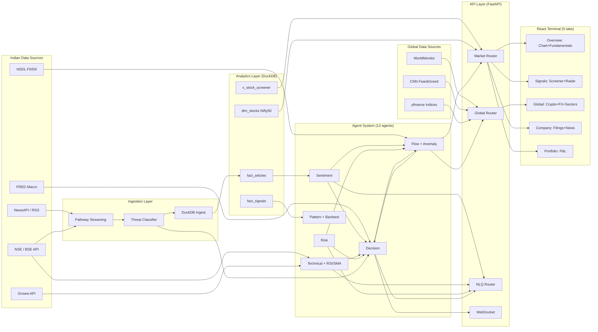
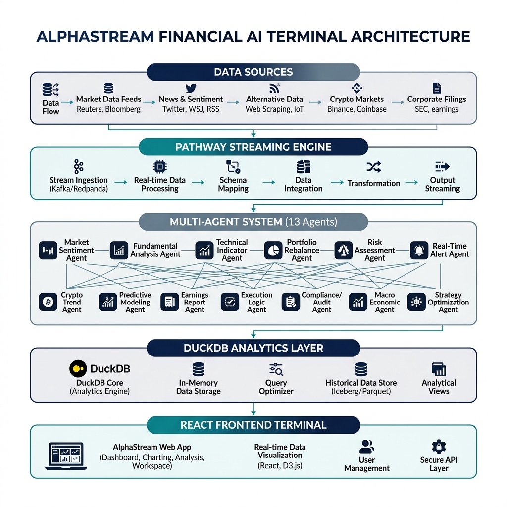

# AlphaStream India — Architecture

Detailed technical architecture for the AlphaStream India AI trading terminal.

---

## System Overview

AlphaStream India implements a **streaming RAG + multi-agent** architecture focused on the Indian equity market (NSE/BSE). The system is designed for:

1. **Real-time data ingestion** — Pathway streaming, <2s latency from news to recommendation
2. **Incremental updates** — Knowledge base updates continuously via Adaptive RAG
3. **Explainable AI** — Every recommendation traces back to sources, agent scores, and signals
4. **India-first context** — ₹ currency, IST timezone, NSE/BSE tickers, Nifty 50 universe

---

## Data Flow



---

## Component Architecture

### 1. Pathway Streaming Engine



AlphaStream leverages **Pathway** as the core streaming engine. Our implementation demonstrates comprehensive feature usage:

#### Pathway Features Used

| Feature | Location | Purpose |
|---------|----------|---------|
| `pw.Schema` | `news_connector.py`, `pathway_tables.py` | Type-safe data schemas |
| `pw.Table` | `pathway_tables.py` | Streaming market data tables |
| `pw.io.python.ConnectorSubject` | `news_connector.py` | Custom multi-source news polling |
| `pw.io.subscribe` | `app.py` | Real-time callbacks on data events |
| `pw.run` | `app.py` | Background Pathway engine |
| `pw.apply` | `pathway_tables.py` | UDF for ticker extraction, labels |
| `pw.filter` | `pathway_tables.py` | Alert generation on sentiment spikes |
| `pw.reducers` | `pathway_tables.py` | Aggregations (avg, count, max, min) |

#### "Herd of Knowledge" Architecture


Our multi-source news aggregator fetches from 5 sources **in parallel**:

```python
# ThreadPoolExecutor for parallel API calls
with concurrent.futures.ThreadPoolExecutor(max_workers=5) as executor:
    futures = {executor.submit(fetch_source, src): src for src in self.sources}
```

- **NewsAPI** - Breaking headlines
- **Finnhub** - Company-specific news (60 calls/min free)
- **Alpha Vantage** - Sentiment-tagged articles (500 calls/day free)
- **MediaStack** - Global business news (500 calls/month free)
- **RSS Feeds** - Unlimited, free fallback

**Result**: 40+ unique articles per refresh cycle, no single point of failure.

```python
# Pathway integration in app.py
import pathway as pw

news_table = create_news_table(refresh_interval=60)
pw.io.subscribe(news_table, on_new_article_callback)
pw.run()  # Background thread
```

### 2. RAG Pipeline

**Chunking Strategy:**
- Sentence-based with semantic boundaries
- ~300 tokens per chunk for optimal retrieval
- Metadata enrichment (source, date, tickers)

**Retrieval:**
- Dense retrieval (sentence-transformers embeddings)
- Sparse retrieval (BM25)
- Reciprocal Rank Fusion (RRF) for combining scores
- Cross-encoder reranking (optional)

### 3. Agent System

Each agent is a specialized LangChain chain:

| Agent | Input | Output | Technology |
|-------|-------|--------|------------|
| Sentiment | Articles | Score (-1 to +1), Label | LangChain + OpenAI |
| Technical | Ticker | Score, RSI, SMA | yfinance + numpy |
| Risk | Technical data | Position size, Stop loss | Volatility calculation |
| Insider | Ticker | Score, Transactions | edgartools + LLM |
| Decision | All agents | BUY/HOLD/SELL | LangChain + OpenAI |

**Agent Communication:**
```
Sentiment ─┐
           │
Technical ─┼─► Decision Agent ─► Recommendation
           │
Risk ──────┤
           │
Insider ───┘
```

### 4. API Layer

FastAPI with:
- **REST endpoints** for synchronous queries
- **WebSocket** for real-time pushes
- **CORS** enabled for frontend
- **Connection Manager** for broadcast

### 5. Frontend

React SPA with:
- **Zustand** for state management
- **WebSocket** for live updates
- **Shadcn UI** components
- **Tailwind CSS** styling

---

## Security Considerations

1. **API Keys** - Never committed to git (`.gitignore`)
2. **Rate Limiting** - SEC fair access (10 req/sec)
3. **Input Validation** - Pydantic models
4. **Error Handling** - Graceful fallbacks

---

## Performance Characteristics

| Metric | Value |
|--------|-------|
| Article ingestion | <100ms |
| Full recommendation | ~10s (LLM bound) |
| Chart generation | ~2s |
| PDF report | ~15s |
| WebSocket latency | <50ms |

---

## Deployment Options

### Local Development
```bash
uv run uvicorn src.api.app:app --reload
```

### Docker
```bash
docker-compose up
```

### Production
- Use gunicorn with uvicorn workers
- Enable persistence for fault tolerance
- Configure logging for monitoring
