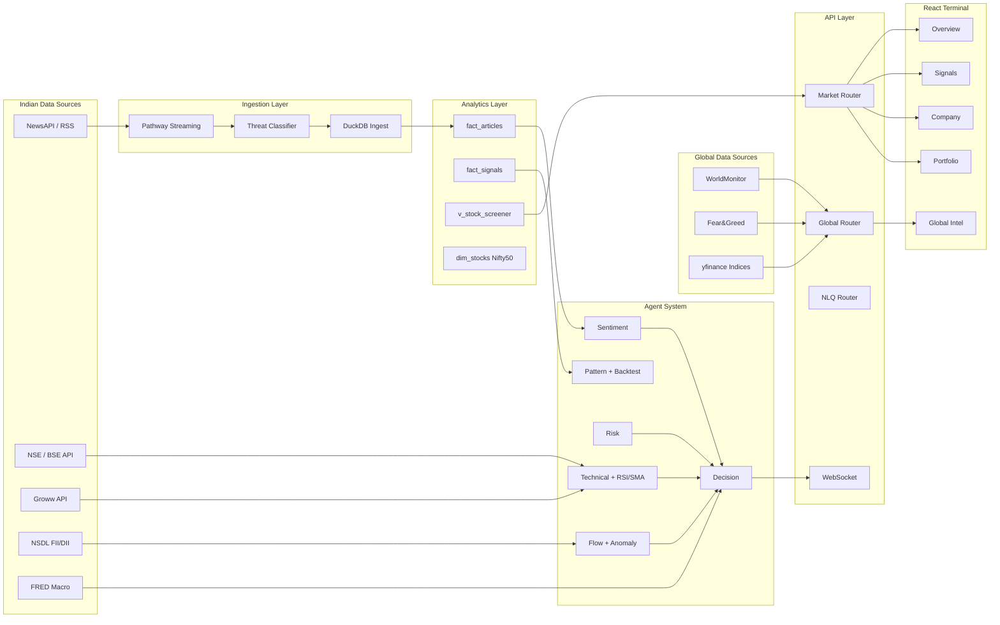
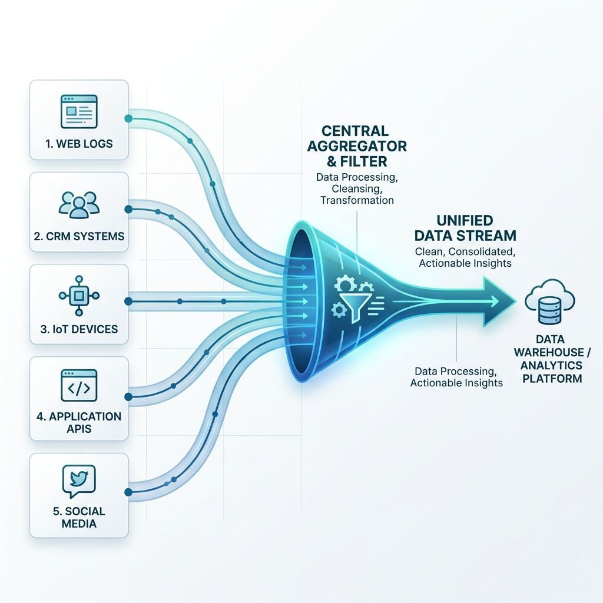

# AlphaStream India - Architecture & Project Documentation

Technical architecture and design document for AlphaStream India.

**ET AI Hackathon 2026 - Problem Statement 6: AI for the Indian Investor**

---

## Executive Summary

AlphaStream India is a **production-grade Bloomberg-style terminal** for the Indian retail investor, built on **Pathway streaming RAG + multi-agent AI**. It addresses the critical gap between institutional-grade analytics and what 14 crore+ Indian demat account holders actually have access to.

**Key Innovations**:
1. **Pathway Adaptive RAG** - <2s latency from news arrival to recommendation update
2. **13-agent reasoning pipeline** - Sentiment, Technical (RSI/SMA), Risk, Decision, Flow, Pattern, Backtest, Filing, Insider, Chart, Report, Search, Anomaly (River ML)
3. **5-tab Bloomberg terminal** - Overview, Signals, Global Intel, Company, Portfolio
4. **WorldMonitor global backbone** - Live global indices, commodities, crypto, FX, macro signals, geopolitical risk wired into every recommendation
5. **DuckDB analytics layer** - Pre-aggregated views (v_stock_screener, v_signal_summary, v_sector_heatmap) powering the screener and NLQ engine
6. **India-first context** - INR currency, IST timezone, NSE/BSE, Nifty 50 universe, Crores/Lakhs formatting throughout

---

## System Overview

AlphaStream India implements a **streaming RAG + multi-agent** architecture focused on the Indian equity market (NSE/BSE). The system is designed for:

1. **Real-time data ingestion** - Pathway streaming, <2s latency from news to recommendation
2. **Incremental updates** - Knowledge base updates continuously via Adaptive RAG
3. **Explainable AI** - Every recommendation traces back to sources, agent scores, and signals
4. **India-first context** - INR currency, IST timezone, NSE/BSE tickers, Nifty 50 universe

### High-Level Architecture

```
+---------------------------------------------------------------------------+
|                         ALPHASTREAM ARCHITECTURE                          |
+---------------------------------------------------------------------------+
|                                                                           |
|  +-------------------------------------------------------------------+   |
|  |                    DATA INGESTION LAYER                            |   |
|  |  NewsAPI | Finnhub | AlphaVantage | MediaStack | RSS               |   |
|  |                     |                                              |   |
|  |            "HERD OF KNOWLEDGE" AGGREGATOR                          |   |
|  |            (Parallel fetching, deduplication)                      |   |
|  +-------------------------------------------------------------------+   |
|                                  |                                        |
|  +-------------------------------------------------------------------+   |
|  |                   PATHWAY STREAMING ENGINE                         |   |
|  |  pw.io.python ConnectorSubject -> DocumentStore -> AdaptiveRAG     |   |
|  |  pw.io.subscribe() -> Real-time callbacks on data changes          |   |
|  +-------------------------------------------------------------------+   |
|                                  |                                        |
|  +-------------------------------------------------------------------+   |
|  |                   MULTI-AGENT REASONING LAYER (13 agents)          |   |
|  |  Sentiment | Technical | Risk | Insider -> Decision Agent          |   |
|  |  Pattern | Backtest | Flow | Filing | Anomaly | Chart | Report     |   |
|  +-------------------------------------------------------------------+   |
|                                  |                                        |
|  +-------------------------------------------------------------------+   |
|  |                      PRESENTATION LAYER                            |   |
|  |  FastAPI REST | WebSocket Streaming | React 5-tab Terminal         |   |
|  +-------------------------------------------------------------------+   |
|                                                                           |
+---------------------------------------------------------------------------+
```

### Component Overview

| Layer | Components | Purpose |
|-------|------------|---------|
| Indian Data Sources | NSE API, BSE API, FII/DII (NSDL), Groww API, ET Markets RSS, NewsAPI, Finnhub, Alpha Vantage | Real-time Indian market data + news from 5+ parallel sources |
| Global Data Sources | WorldMonitor (yfinance indices, crypto, FX, commodities), CNN Fear and Greed, FRED Macro | Global context wired into every recommendation |
| Streaming Engine | Pathway (pw.io, pw.xpacks.llm, Adaptive RAG) | Incremental processing, auto-updating indexes |
| Analytics Layer | DuckDB (fact_articles, fact_signals, v_stock_screener, dim_stocks) | Pre-aggregated views for screener + NLQ |
| Reasoning | 13 specialized AI agents | Multi-perspective market analysis |
| NLQ Agent | LangGraph 7-node pipeline (Guardrail, Enrich, Route, Analytics/Text2SQL, Narrate, Output Guardrail) | Natural language queries grounded in real data |
| Presentation | FastAPI + WebSocket + SSE, React 19 (5-tab Bloomberg terminal) | Real-time delivery to users |

---

## Data Flow



---

## Pathway Integration

### Primary RAG: Pathway Adaptive RAG (xpacks.llm)

Our primary RAG implementation uses Pathway's official LLM xpack, following the adaptive_rag template:

```python
from pathway.xpacks.llm.question_answering import AdaptiveRAGQuestionAnswerer
from pathway.xpacks.llm.document_store import DocumentStore
from pathway.xpacks.llm import llms, embedders, splitters

document_store = DocumentStore(
    docs=pw.io.fs.read(path="data/articles", format="binary"),
    parser=parsers.UnstructuredParser(),
    splitter=splitters.TokenCountSplitter(max_tokens=400),
    retriever_factory=pw.indexing.UsearchKnnFactory(
        embedder=embedders.SentenceTransformerEmbedder("all-MiniLM-L6-v2"),
        metric=pw.indexing.USearchMetricKind.COS
    )
)

question_answerer = AdaptiveRAGQuestionAnswerer(
    llm=llms.LiteLLMChat(model="openrouter/google/gemma-3n-e2b-it:free"),
    indexer=document_store,
    n_starting_documents=2,
    factor=2,
    max_iterations=4
)
```

### Geometric Retrieval Strategy

The Adaptive RAG optimizes token usage:

```
Query -> Retrieve 2 docs -> LLM evaluates sufficiency
                                    |
                         Sufficient? -> Return answer
                                    |
                              No -> Retrieve 4 docs -> LLM evaluates
                                    |
                              No -> Retrieve 8 docs -> ...
                                    |
                         (Max 4 iterations, max 16 docs)
```

### Pathway Features Utilized

| Feature | File | Purpose |
|---------|------|---------|
| `pw.Schema` | `news_connector.py`, `pathway_tables.py` | Type-safe data schemas |
| `pw.Table` | `pathway_tables.py` | Streaming market data tables |
| `pw.io.python.ConnectorSubject` | `news_connector.py` | Custom polling connector |
| `pw.io.fs.read` | `adaptive_rag_server.py` | File-based document ingestion |
| `pw.io.subscribe` | `app.py` | Real-time event callbacks |
| `pw.run` | `app.py` | Background Pathway engine |
| `pw.apply` | `pathway_tables.py` | UDF transformations |
| `pw.filter` | `pathway_tables.py` | Event filtering |
| `pw.reducers` | `pathway_tables.py` | Aggregations (avg, count, max) |
| `pw.indexing.UsearchKnnFactory` | `adaptive_rag_server.py` | Vector search |
| `pw.persistence` | `pathway_rag.yaml` | Caching and fault tolerance |
| `pw.xpacks.llm.*` | `adaptive_rag_server.py` | Official LLM components |

### "Herd of Knowledge" Architecture



Multi-source news aggregator fetches from 5 sources in parallel:

```python
with concurrent.futures.ThreadPoolExecutor(max_workers=5) as executor:
    futures = {executor.submit(fetch_source, src): src for src in self.sources}
```

- **NewsAPI** - Breaking headlines
- **Finnhub** - Company-specific news (60 calls/min free)
- **Alpha Vantage** - Sentiment-tagged articles (500 calls/day free)
- **MediaStack** - Global business news (500 calls/month free)
- **RSS Feeds** - Unlimited, free fallback

Result: 40+ unique articles per refresh cycle, no single point of failure.

### RAG Pipeline

- **Chunking**: Sentence-based with semantic boundaries, ~300 tokens per chunk, metadata enrichment (source, date, tickers)
- **Retrieval**: Dense (sentence-transformers) + Sparse (BM25) + Reciprocal Rank Fusion (RRF)
- **Reranking**: Optional cross-encoder reranking

---

## Multi-Agent Reasoning System


### Agent Specifications

| Agent | File | Input | Output |
|-------|------|-------|--------|
| Sentiment | `sentiment_agent.py` | Articles | Score (-1 to +1), Label |
| Technical | `technical_agent.py` | Ticker | Score, RSI, SMA signals |
| Risk | `risk_agent.py` | Technical data | Position size, Stop loss |
| Decision | `decision_agent.py` | All agent outputs + global context | BUY/HOLD/SELL with confidence |
| Insider | `insider_agent.py` | Ticker | Score, Transactions (NSE SAST/PIT) |
| Flow | `flow_agent.py` | FII/DII data | Streak detection, divergence |
| Pattern | `pattern_agent.py` | OHLCV | Chart patterns (RSI div, MACD cross, etc.) |
| Backtest | `backtest_agent.py` | Ticker + Pattern | 5yr win rates (5d/10d/30d) |
| Chart | `chart_agent.py` | Ticker | Chart spec for frontend |
| Report | `report_agent.py` | All agents | PDF research report |
| Search | `search_agent.py` | Query | Web context enrichment |
| Anomaly | `anomaly_agent.py` | OHLCV | Price/volume anomalies (River ML) |
| Filing | (BSE connector) | Ticker | Corporate announcements |

### Agent Communication

```
Sentiment --+
            |
Technical --+--- Decision Agent --- Recommendation
            |
Risk -------+
            |
Insider ----+
            |
Flow -------+
            |
Global Ctx -+
```

The Decision Agent receives all upstream agent outputs plus global market context (VIX, Fear & Greed, FII/DII flows, geopolitical risk) and produces the final BUY/HOLD/SELL recommendation with a confidence score.

### NLQ Agent (LangGraph Pipeline)

```
START -> input_guardrail -> enrich -> router -> analytics  \
                                                 text2sql   |-> narrate -> output_guardrail -> END
                                                 (direct)  /
```

- **input_guardrail** - Topic filter, blocks off-topic queries
- **enrich** - Cyclic web search (up to 3 rounds) + persistent user memory
- **router** - Classifies query into 10 intents (SIGNAL_QUERY, INSIDER_QUERY, FLOW_QUERY, etc.)
- **analytics** - MCP tool calls (market_data, signal, search servers)
- **text2sql** - Generates and executes SQL against DuckDB (30s timeout, 5000-row cap)
- **narrate** - LLM narrative synthesis with source citations
- **output_guardrail** - Safety and quality check on final answer

---

## Analytics Layer (DuckDB)

`market_analytics.duckdb` stores structured market data for fast analytical queries.

| Table / View | Purpose |
|---|---|
| `fact_articles` | Ingested news with sentiment and threat classification |
| `fact_signals` | Detected trading signals with alpha scores |
| `fact_insider_trades` | NSE SAST/PIT insider trade records |
| `fact_fii_dii_flows` | Daily FII/DII net flow data |
| `fact_bulk_deals` | NSE bulk/block deals |
| `dim_stocks` | Nifty 50 ticker universe with sector mapping |
| `insights` | AI-generated ambient alerts |
| `v_stock_screener` | Pre-aggregated screener view |
| `v_signal_summary` | Signal summary by ticker |
| `v_sector_heatmap` | Sector-level signal aggregation |

---

## API Layer

FastAPI with four routers:

- **Market Router** (`/api/`) - OHLCV, screener, patterns, backtest, flows, portfolio, filings, anomalies, fundamentals
- **Global Router** (`/api/global/`) - Indices, commodities, crypto, FX, VIX, Fear & Greed, macro, geo-risk
- **NLQ Router** (`/api/`) - Blocking and SSE streaming natural language queries
- **Insights Router** (`/api/`) - Ambient AI alerts and notification management
- **Core Endpoints** - `/recommend` (multi-agent recommendation), `/ws/stream/{ticker}` (WebSocket)

60+ REST endpoints. Full interactive docs at `/docs` (Swagger UI).

---

## Frontend

React 19 single-page application with 5-tab Bloomberg-style layout:

| Tab | Components |
|-----|------------|
| **Overview** | Candlestick chart (RSI/SMA overlays), AI recommendation, agent radar, fundamentals, anomalies, opportunity radar, flow chart |
| **Signals** | Stock screener, sector heatmap, market heatmap, insider activity, network graph |
| **Global Intel** | Crypto/FX/US sectors, Fear & Greed gauge, macro signals, commodities, geo-risk |
| **Company** | News articles with threat badges, corporate filings, watchlist, report download |
| **Portfolio** | Holdings manager, live P&L chart, Groww import |

**State**: Zustand with localStorage persistence
**Real-time**: WebSocket at `/ws/stream/{ticker}` with auto-reconnect (exponential backoff)
**NLQ**: Two-stage panel (compact floating + expanded modal) with SSE streaming and dynamic chart rendering

---

## Technology Stack

| Layer | Technology |
|---|---|
| Streaming | Pathway (real-time RAG, <2s latency) |
| LLM | Gemini 2.0 Flash (Vertex AI) + OpenRouter |
| Agents | LangChain + LangGraph (multi-agent orchestration) |
| NLQ | Text2SQL pipeline with guardrails + correction loop |
| MCP | FastMCP servers (market data, signals, portfolio) |
| Database | DuckDB (analytics), ChromaDB (vector search) |
| Backend | FastAPI + WebSocket + SSE streaming |
| Frontend | React 19, Zustand, Tailwind, Recharts, Framer Motion, lightweight-charts |
| Market Data | NSE API, BSE API, Groww API (TOTP), yfinance, ET Markets RSS |

---

## Security

1. **API Keys** - Never committed to git (`.gitignore`)
2. **Rate Limiting** - SEC fair access (10 req/sec)
3. **Input Validation** - Pydantic models on all endpoints
4. **Error Handling** - Graceful fallbacks with informative error responses
5. **NLQ Guardrails** - Input and output guardrails block off-topic and unsafe content

---

## Performance

| Metric | Value |
|--------|-------|
| Article ingestion | <200ms |
| Full recommendation | ~7s (LLM bound) |
| WebSocket delivery | <50ms |
| Data to update (Pathway) | <2 seconds |
| Token savings (Adaptive RAG) | ~40% |
| Nifty 50 coverage | 50 stocks, 12 sectors |
| REST endpoints | 60+ |

---

## Deployment

See `DEPLOYMENT.md` for step-by-step setup instructions.

```bash
# Quick start
cd backend && uv sync && cp .env.example .env && ./start.sh
cd frontend && npm install && npm run dev
# Open http://localhost:5173
```

Docker: `docker-compose up`
