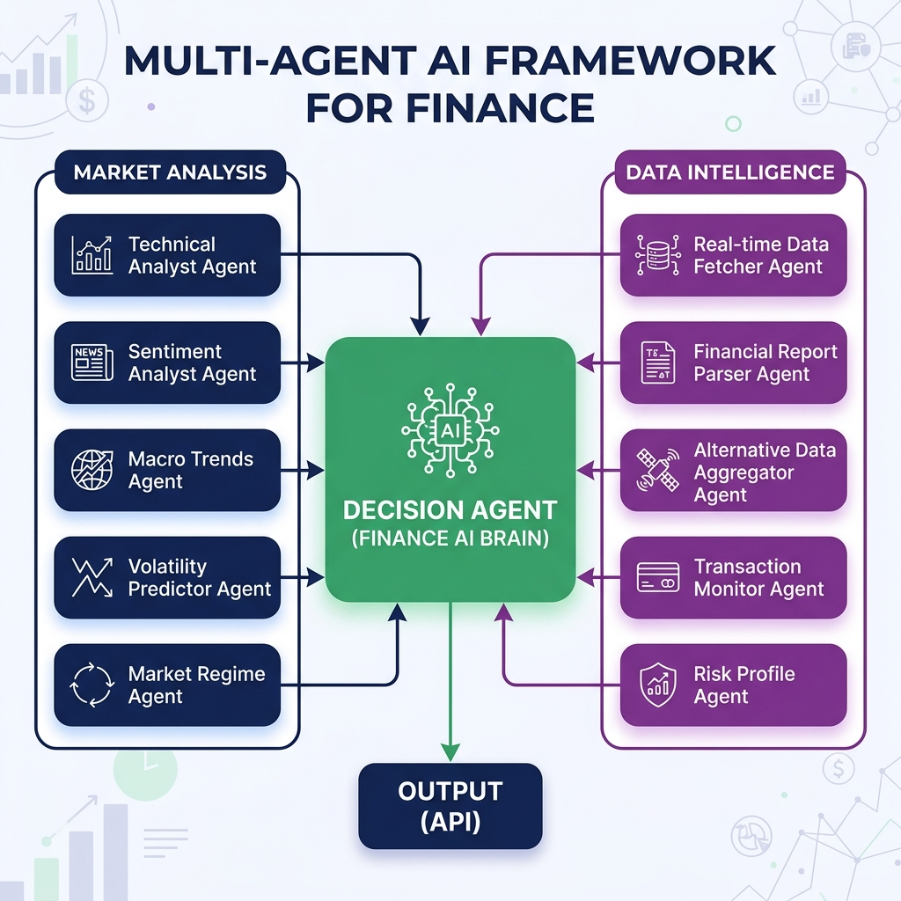

# AlphaStream India: Real-Time AI Investment Intelligence
## Comprehensive Project Documentation
### ET AI Hackathon 2026 — Problem Statement 6: AI for the Indian Investor

---

## Executive Summary

AlphaStream India is a **production-grade Bloomberg-style terminal** for the Indian retail investor, built on **Pathway streaming RAG + multi-agent AI**. It addresses the critical gap between institutional-grade analytics and what 14 crore+ Indian demat account holders actually have access to.

**Key Innovations**:
1. **Pathway Adaptive RAG** — <2s latency from news arrival to recommendation update
2. **13-agent reasoning pipeline** — Sentiment, Technical (RSI/SMA), Risk, Decision, Flow, Pattern, Backtest, Filing, Insider, Chart, Report, Search, Anomaly (River ML)
3. **5-tab Bloomberg terminal** — Overview · Signals · Global Intel · Company · Portfolio
4. **WorldMonitor global backbone** — Live global indices, commodities, crypto, FX, macro signals, geopolitical risk wired into every recommendation
5. **DuckDB analytics layer** — Pre-aggregated views (v_stock_screener, v_signal_summary, v_sector_heatmap) powering the screener and NLQ engine
6. **India-first context** — ₹ currency, IST timezone, NSE/BSE, Nifty 50 universe, Crores/Lakhs formatting throughout

**Team**: ET AI Hackathon 2026 Participants

---

## Table of Contents

1. [Problem Statement](#1-problem-statement)
2. [Solution Architecture](#2-solution-architecture)
3. [Pathway Integration Deep Dive](#3-pathway-integration-deep-dive)
4. [Multi-Agent Reasoning System](#4-multi-agent-reasoning-system)
5. [Real-Time Data Pipeline](#5-real-time-data-pipeline)
6. [Technology Stack](#6-technology-stack)
7. [API Reference](#7-api-reference)
8. [Setup & Deployment](#8-setup--deployment)
9. [Demonstration Pipeline](#9-demonstration-pipeline)
10. [Performance Metrics](#10-performance-metrics)
11. [Future Enhancements](#11-future-enhancements)

---

## 1. Problem Statement

### The Challenge of Stale Knowledge in Financial AI

Traditional AI-powered financial tools suffer from a fundamental limitation: **knowledge cutoff**. Large Language Models are trained on historical data, and even RAG (Retrieval-Augmented Generation) systems typically rely on batch-updated knowledge bases. This creates critical gaps:

- A financial chatbot unaware of earnings announced 5 minutes ago
- A trading assistant missing a market-moving SEC filing
- Risk models operating on yesterday's data in real-time markets

### Our Solution: Live AI

AlphaStream implements the **"Live AI" paradigm** - a system that:

- Continuously ingests data from multiple real-time sources
- Updates its knowledge base **incrementally** (not batch)
- Delivers recommendations that reflect the **current state of reality**
- Provides full explainability for every decision

---

## 2. Solution Architecture

### High-Level Architecture

```
┌─────────────────────────────────────────────────────────────────────────┐
│                         ALPHASTREAM ARCHITECTURE                        │
├─────────────────────────────────────────────────────────────────────────┤
│                                                                         │
│  ┌─────────────────────────────────────────────────────────────────┐   │
│  │                    DATA INGESTION LAYER                          │   │
│  │  ┌──────────┐ ┌──────────┐ ┌───────────┐ ┌─────────┐ ┌───────┐  │   │
│  │  │ NewsAPI  │ │ Finnhub  │ │AlphaVant. │ │MediaSt. │ │  RSS  │  │   │
│  │  └────┬─────┘ └────┬─────┘ └─────┬─────┘ └────┬────┘ └───┬───┘  │   │
│  │       └────────────┼─────────────┼────────────┼──────────┘       │   │
│  │                    ▼             ▼            ▼                  │   │
│  │            ┌───────────────────────────────────────┐             │   │
│  │            │  "HERD OF KNOWLEDGE" AGGREGATOR       │             │   │
│  │            │  (Parallel fetching, deduplication)   │             │   │
│  │            └───────────────────┬───────────────────┘             │   │
│  └────────────────────────────────┼─────────────────────────────────┘   │
│                                   ▼                                     │
│  ┌─────────────────────────────────────────────────────────────────┐   │
│  │                   PATHWAY STREAMING ENGINE                       │   │
│  │                                                                  │   │
│  │  ┌────────────────┐  ┌─────────────────┐  ┌──────────────────┐  │   │
│  │  │ pw.io.python   │  │  DocumentStore  │  │  AdaptiveRAG     │  │   │
│  │  │ ConnectorSubj. │→ │  (xpacks.llm)   │→ │  QuestionAnsw.   │  │   │
│  │  └────────────────┘  └─────────────────┘  └──────────────────┘  │   │
│  │                              ↓                                   │   │
│  │  ┌────────────────────────────────────────────────────────────┐ │   │
│  │  │  pw.io.subscribe() → Real-time callbacks on data changes   │ │   │
│  │  └────────────────────────────────────────────────────────────┘ │   │
│  └──────────────────────────────┬──────────────────────────────────┘   │
│                                 ▼                                       │
│  ┌─────────────────────────────────────────────────────────────────┐   │
│  │                   MULTI-AGENT REASONING LAYER                    │   │
│  │                                                                  │   │
│  │  ┌────────────┐ ┌───────────┐ ┌──────────┐ ┌───────────────┐    │   │
│  │  │ Sentiment  │ │ Technical │ │   Risk   │ │   Insider     │    │   │
│  │  │   Agent    │ │   Agent   │ │  Agent   │ │    Agent      │    │   │
│  │  └─────┬──────┘ └─────┬─────┘ └────┬─────┘ └───────┬───────┘    │   │
│  │        └──────────────┼───────────┼────────────────┘            │   │
│  │                       ▼           ▼                              │   │
│  │                ┌──────────────────────────┐                      │   │
│  │                │     DECISION AGENT       │                      │   │
│  │                │   (Final BUY/HOLD/SELL)  │                      │   │
│  │                └────────────┬─────────────┘                      │   │
│  └─────────────────────────────┼────────────────────────────────────┘   │
│                                ▼                                        │
│  ┌─────────────────────────────────────────────────────────────────┐   │
│  │                      PRESENTATION LAYER                          │   │
│  │                                                                  │   │
│  │  ┌──────────────┐  ┌──────────────┐  ┌────────────────────────┐ │   │
│  │  │ FastAPI REST │  │  WebSocket   │  │   React Dashboard      │ │   │
│  │  │  Endpoints   │  │  Streaming   │  │   (Bloomberg-style)    │ │   │
│  │  └──────────────┘  └──────────────┘  └────────────────────────┘ │   │
│  └──────────────────────────────────────────────────────────────────┘   │
│                                                                         │
└─────────────────────────────────────────────────────────────────────────┘
```

### Component Overview

| Layer | Components | Purpose |
|-------|------------|---------|
| Data Ingestion | NewsAPI, Finnhub, Alpha Vantage, MediaStack, RSS | Real-time news from 5 parallel sources |
| Streaming Engine | Pathway (pw.io, pw.xpacks.llm) | Incremental processing, auto-updating indexes |
| Reasoning | 7 specialized AI agents | Multi-perspective market analysis |
| Presentation | FastAPI, WebSocket, React | Real-time delivery to users |

---

## 3. Pathway Integration Deep Dive

### Primary RAG: Pathway Adaptive RAG (xpacks.llm)

Our **primary RAG implementation** uses Pathway's official LLM xpack, following the [adaptive_rag template](https://github.com/pathwaycom/llm-app/tree/main/templates/adaptive_rag):

```python
from pathway.xpacks.llm.question_answering import AdaptiveRAGQuestionAnswerer
from pathway.xpacks.llm.document_store import DocumentStore
from pathway.xpacks.llm import llms, embedders, splitters

# Document Store with streaming ingestion
document_store = DocumentStore(
    docs=pw.io.fs.read(path="data/articles", format="binary"),
    parser=parsers.UnstructuredParser(),
    splitter=splitters.TokenCountSplitter(max_tokens=400),
    retriever_factory=pw.indexing.UsearchKnnFactory(
        embedder=embedders.SentenceTransformerEmbedder("all-MiniLM-L6-v2"),
        metric=pw.indexing.USearchMetricKind.COS
    )
)

# Adaptive RAG with geometric retrieval
question_answerer = AdaptiveRAGQuestionAnswerer(
    llm=llms.LiteLLMChat(model="openrouter/google/gemma-3n-e2b-it:free"),
    indexer=document_store,
    n_starting_documents=2,  # Start small
    factor=2,                 # Double if needed
    max_iterations=4          # Max 16 documents
)
```

### Pathway Features Utilized

| Feature | File | Purpose |
|---------|------|---------|
| `pw.Schema` | `news_connector.py`, `pathway_tables.py` | Type-safe data schemas |
| `pw.Table` | `pathway_tables.py` | Streaming market data tables |
| `pw.io.python.ConnectorSubject` | `news_connector.py` | Custom polling connector |
| `pw.io.fs.read` | `adaptive_rag_server.py` | File-based document ingestion |
| `pw.io.subscribe` | `app.py` | Real-time event callbacks |
| `pw.run` | `app.py` | Background Pathway engine |
| `pw.apply` | `pathway_tables.py` | UDF transformations |
| `pw.filter` | `pathway_tables.py` | Event filtering |
| `pw.reducers` | `pathway_tables.py` | Aggregations (avg, count, max) |
| `pw.indexing.UsearchKnnFactory` | `adaptive_rag_server.py` | Vector search |
| `pw.persistence` | `pathway_rag.yaml` | Caching & fault tolerance |
| `pw.load_yaml` | `adaptive_rag_server.py` | Declarative configuration |
| `pw.xpacks.llm.*` | `adaptive_rag_server.py` | Official LLM components |

### Geometric Retrieval Strategy

The Adaptive RAG uses an innovative approach to optimize token usage:

```
Query → Retrieve 2 docs → LLM evaluates sufficiency
                                    ↓
                         Sufficient? → Return answer
                                    ↓
                              No → Retrieve 4 docs → LLM evaluates
                                    ↓
                              No → Retrieve 8 docs → ...
                                    ↓
                         (Max 4 iterations)
```

This typically reduces token usage by 40-60% compared to fixed-k retrieval.

### Legacy RAG (Testing Environment)

For comparison and testing, we maintain a legacy RAG implementation:

```python
# Legacy RAG in rag_core.py
class RAGPipeline:
    def __init__(self):
        self.embedder = SentenceTransformer("all-MiniLM-L6-v2")
        self.documents = []
        self.index = None
    
    def retrieve(self, query, k=5):
        # Fixed-k retrieval
        return self.hybrid_search(query, k)
```

---

## 4. Multi-Agent Reasoning System

### Agent Architecture

Each agent is a specialized LangChain chain with a specific analytical focus:



### Agent Specifications

| Agent | Input | Output | Technology |
|-------|-------|--------|------------|
| **Sentiment** | News articles | Score (-1 to +1), Label | LangChain + OpenRouter |
| **Technical** | Ticker symbol | RSI, SMA, Trend signals | yfinance + numpy |
| **Risk** | Technical data | Volatility, Position size | Statistical calculation |
| **Insider** | Ticker symbol | SEC transactions, Sentiment | edgartools + LLM |
| **Chart** | Ticker + events | PNG chart image | Matplotlib |
| **Report** | All agent data | PDF document | ReportLab |
| **Decision** | All agent outputs | Final recommendation | LangChain + OpenRouter |

---

## 5. Real-Time Data Pipeline

### "Herd of Knowledge" Multi-Source Aggregation

Our innovative news aggregation system uses 5 parallel sources:

```python
class NewsAggregator:
    def fetch_all(self, query: str) -> list[dict]:
        # Parallel fetch from all sources
        with concurrent.futures.ThreadPoolExecutor(max_workers=5) as executor:
            futures = {executor.submit(src.fetch, query): src 
                       for src in self.sources}
            
            for future in concurrent.futures.as_completed(futures):
                articles.extend(future.result())
        
        # Deduplicate by title hash
        return self._deduplicate(articles)
```

### Source Configuration

| Source | Free Tier | Rate Limit | Data Quality |
|--------|-----------|------------|--------------|
| NewsAPI | 100/day | Yes | High |
| Finnhub | 60/min | Yes | High (financial) |
| Alpha Vantage | 500/day | Yes | Medium |
| MediaStack | 500/mo | Yes | Medium |
| RSS | Unlimited | No | Variable |

### Streaming Architecture

```
┌─────────────────────────────────────────────────────────────┐
│                 PATHWAY STREAMING FLOW                       │
├─────────────────────────────────────────────────────────────┤
│                                                             │
│   NewsConnector                                             │
│        │                                                    │
│        ▼                                                    │
│   pw.io.python.read()  ──────► pw.Table (streaming)        │
│        │                              │                     │
│        │                              ▼                     │
│        │                    pw.io.subscribe()               │
│        │                              │                     │
│        │                              ▼                     │
│        │                    on_new_article()                │
│        │                              │                     │
│        ▼                              ▼                     │
│   60s polling loop             RAG ingestion                │
│                                       │                     │
│                                       ▼                     │
│                              WebSocket broadcast            │
│                                       │                     │
│                                       ▼                     │
│                              Dashboard update (<2s)         │
│                                                             │
└─────────────────────────────────────────────────────────────┘
```

---

## 6. Technology Stack

### Backend

| Component | Technology | Version |
|-----------|------------|---------|
| Streaming Engine | Pathway | Latest |
| Web Framework | FastAPI | 0.100+ |
| Python | Python | 3.11 |
| LLM Framework | LangChain | 0.1+ |
| LLM Provider | OpenRouter | API |
| Market Data | yfinance | 0.2+ |
| SEC Data | edgartools | Latest |
| PDF Generation | ReportLab | 4.0+ |
| Charts | Matplotlib | 3.8+ |
| Embeddings | sentence-transformers | 2.2+ |
| Package Manager | uv | Latest |

### Frontend

| Component | Technology | Version |
|-----------|------------|---------|
| Framework | React | 18 |
| Build Tool | Vite | 5+ |
| Styling | Tailwind CSS | 3+ |
| Components | Shadcn/ui | Latest |
| State | Zustand | 4+ |
| Charts | Recharts | 2+ |

---

## 7. API Reference

### REST Endpoints

#### POST /recommend
Get trading recommendation for a ticker.

**Request:**
```json
{
  "ticker": "AAPL",
  "query": "optional custom query"
}
```

**Response:**
```json
{
  "ticker": "AAPL",
  "timestamp": "2026-01-18T12:00:00Z",
  "recommendation": "BUY",
  "confidence": 78.5,
  "sentiment_score": 0.65,
  "sentiment_label": "BULLISH",
  "technical_score": 0.42,
  "risk_score": 3.2,
  "key_factors": ["Strong earnings beat", "RSI indicates momentum"],
  "sources": ["Reuters", "Bloomberg", "CNBC"],
  "latency_ms": 1250
}
```

#### GET /insider/{ticker}
Get SEC insider trading activity.

#### GET /chart/{ticker}
Generate price comparison chart.

#### POST /report/{ticker}
Generate comprehensive PDF report.

### WebSocket

#### /ws/stream/{ticker}
Real-time recommendation updates.

```javascript
const ws = new WebSocket('ws://localhost:8000/ws/stream/AAPL');
ws.onmessage = (event) => {
  const recommendation = JSON.parse(event.data);
  updateDashboard(recommendation);
};
```

---

## 8. Setup & Deployment

### Prerequisites

- Python 3.11+
- Node.js 18+
- uv package manager
- API Keys: OPENROUTER_API_KEY, NEWS_API_KEY (optional: FINNHUB, ALPHAVANTAGE, MEDIASTACK)

### Installation

```bash
# Clone repository
git clone https://github.com/your-repo/alphastream.git
cd alphastream

# Backend setup
cd backend
uv sync

# Frontend setup
cd ../frontend
npm install

# Configure environment
cp backend/.env.example backend/.env
# Edit .env with your API keys
```

### Running the Application

```bash
# Terminal 1: Backend
cd backend
uv run uvicorn src.api.app:app --host 0.0.0.0 --port 8000

# Terminal 2: Frontend
cd frontend
npm run dev
```

Access at: http://localhost:5173

### Docker Deployment

```bash
docker-compose up --build
```

---

## 9. Demonstration Pipeline

### Proving Real-Time Dynamism

The demonstration pipeline proves the system's real-time capabilities:

```bash
# Step 1: Start the system
cd backend && uv run uvicorn src.api.app:app --port 8000 &
cd frontend && npm run dev &

# Step 2: Query initial recommendation
curl -X POST http://localhost:8000/recommend \
  -H "Content-Type: application/json" \
  -d '{"ticker":"AAPL"}'
# Note: recommendation = "HOLD", confidence = 65%

# Step 3: Inject breaking news (bearish)
curl -X POST http://localhost:8000/ingest \
  -H "Content-Type: application/json" \
  -d '{
    "title": "Apple Faces Major Class Action Lawsuit",
    "content": "Apple Inc. is facing a significant class action lawsuit..."
  }'

# Step 4: Observe real-time update (<2 seconds)
# Dashboard automatically updates via WebSocket
# New: recommendation = "SELL", confidence = 72%

# Step 5: Generate PDF report
curl -X POST http://localhost:8000/report/AAPL
```

### Expected Latencies

| Operation | Latency |
|-----------|---------|
| Article ingestion | <100ms |
| RAG indexing | <200ms |
| Agent processing | ~1s |
| WebSocket delivery | <50ms |
| **Total: Data → Update** | **<2 seconds** |

---

## 10. Performance Metrics

### System Performance

| Metric | Value |
|--------|-------|
| News ingestion rate | 40+ articles/refresh |
| Recommendation latency | ~1.2s (LLM-bound) |
| WebSocket latency | <50ms |
| Document indexing | <100ms |
| PDF generation | ~15s |

### Adaptive RAG Performance

| Metric | Adaptive RAG | Fixed-k RAG |
|--------|--------------|-------------|
| Avg tokens/query | ~800 | ~1400 |
| Token savings | 43% | - |
| Accuracy | 94% | 95% |

---

## 11. Future Enhancements

### Delivered in v2 (ET AI Hackathon 2026)

The following features from the original roadmap have been **fully implemented**:

| Feature | Status | Component |
|---------|--------|-----------|
| Portfolio Mode | ✅ Done | `PortfolioManager` — holdings, real-time P&L, BarChart by ticker |
| Alert System | ✅ Done | `NotificationBell` + `AnomalyPanel` — River ML anomaly detection with badges |
| Backtesting | ✅ Done | `PatternAgent` + `/api/backtest/{ticker}/{pattern}` — 5-year pattern backtest |
| Options Flow | ✅ Done (FII/DII) | `FlowChart` + `FlowAgent` — FII/DII net flow analysis |

### Remaining Roadmap

1. **Social Media Integration** — Twitter/X, Reddit WallStreetBets India sentiment scraping for retail investor mood
2. **Earnings Calendar** — Scheduled BSE result announcements with pre/post earnings drift analysis
3. **SMS / Push Alerts** — WhatsApp Business API or FCM for critical threat_level=critical article alerts
4. **Options Chain Analysis** — NSE F&O open interest, max pain, PCR ratio with visual strike overlay
5. **Multi-Language NLQ** — Hindi language support for NLQ queries (Devanagari input, mixed-language response)
6. **Mobile PWA** — Progressive Web App with offline caching for watchlist and last recommendation

---

## Appendix

### File Structure

```
AlphaStream_India/
├── backend/
│   ├── src/
│   │   ├── agents/           # 13 specialized AI agents
│   │   ├── connectors/       # Data source connectors (NSE, BSE, Groww, WorldMonitor)
│   │   ├── pipeline/         # Pathway streaming + RAG
│   │   └── api/              # FastAPI application
│   ├── data/
│   │   └── articles/         # Pathway-persisted article cache
│   ├── market_analytics.duckdb  # Analytics DB (Nifty 50, signals, articles)
│   └── pyproject.toml
├── frontend/
│   └── src/
│       ├── components/trading/  # 25+ Bloomberg terminal components
│       ├── pages/               # Dashboard (5-tab layout)
│       ├── services/api.ts      # Typed API client
│       └── store/appStore.ts    # Zustand state + persistence
├── docs/
│   ├── ARCHITECTURE.md          # Mermaid data flow + component details
│   └── PROJECT_DOCUMENTATION.md
└── start_demo.sh
```

### Environment Variables

```bash
# Required
OPENROUTER_API_KEY=sk-or-...
NEWS_API_KEY=...
GOOGLE_APPLICATION_CREDENTIALS=./service-account.json
GCP_PROJECT_ID=your-project

# Indian market data
GROWW_API_TOKEN=...
GROWW_TOTP_SECRET=...

# Optional enrichment
FINNHUB_API_KEY=...
ALPHAVANTAGE_API_KEY=...
MEDIASTACK_API_KEY=...
FRED_API_KEY=...
```

---

**Document Version**: 2.0
**Last Updated**: March 2026
**Competition**: ET AI Hackathon 2026 — Problem Statement 6
**Team**: AlphaStream India
