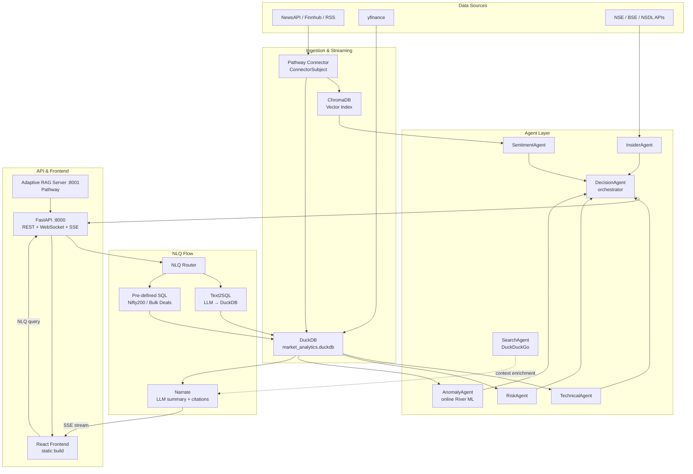

# AlphaStream India — Submission Architecture

## Data-Flow Diagram



---

## Agent Roles

| Agent | Role | Inputs | Outputs |
|-------|------|--------|---------|
| SentimentAgent | Scores news sentiment -1 to +1 | Retrieved article chunks | sentiment_score, label, key_factors |
| TechnicalAgent | Computes RSI, MACD, SMA signals | yfinance OHLCV | technical_score, key_signals |
| RiskAgent | Volatility & position-sizing | Technical data, price history | risk_score, stop_loss |
| PatternAgent | Detects 7 chart patterns | 6mo OHLCV data | patterns with confidence + explanation |
| BacktestAgent | Validates signals historically (5yr) | Pattern + historical OHLCV | win_rate, avg_return, sharpe |
| FilingAgent | Classifies BSE/NSE filings | Announcement text | materiality, sentiment, key_facts |
| FlowAgent | FII/DII institutional streak detection | NSDL flow data | flow_signal, streak_days, divergence |
| InsiderAgent | Parses NSE SAST/PIT insider trades | NSE EDGAR data | insider_score, transactions |
| AnomalyAgent | Online anomaly detection (River) | Price ticks, volume, sentiment | anomaly_flags, drift_alerts |
| SearchAgent | Web context enrichment | NLQ query | title, url, snippet per result |
| ChartAgent | Generates annotated price charts | yfinance OHLCV | PNG chart path |
| ReportAgent | Generates comprehensive PDF reports | All agent outputs | PDF report path |
| DecisionAgent | Final BUY/HOLD/SELL orchestrator | All agent outputs | recommendation, confidence, reasoning |

---

## Agent Communication

Agents are stateless Python classes invoked sequentially inside `generate_recommendation_logic()`. No message broker is used — the orchestrator calls each agent in order and passes results forward:

```
SentimentAgent ─┐
TechnicalAgent ─┼─► DecisionAgent ─► RecommendationResponse
RiskAgent      ─┤
InsiderAgent   ─┤
AnomalyAgent   ─┘
```

The NLQ path is separate: `NLQ Router → Text2SQL or Pre-defined SQL → DuckDB → Narrate → SSE`. `SearchAgent` is called as optional enrichment when the local DuckDB result set has fewer than 5 rows.

Real-time updates flow over WebSocket (`/ws/stream/{ticker}`). Pathway runs in a background daemon thread and fires `on_new_article` callbacks that trigger recommendation refreshes via `asyncio.run_coroutine_threadsafe`.

---

## Tool Integrations

| Tool | Purpose |
|------|---------|
| Pathway `pw.io.python.ConnectorSubject` | Multi-source streaming news ingestion |
| Pathway `pw.io.subscribe` | Article-arrival callbacks to RAG pipeline |
| Adaptive RAG Server (port 8001) | Pathway-powered vector search with incremental indexing |
| DuckDB | Structured market data store (prices, signals, filings, FII/DII) |
| ChromaDB | Dense vector index for semantic article retrieval |
| FastMCP servers | 4 MCP tool servers: market_data, signals, portfolio, search |
| yfinance | OHLCV price data (.NS suffix for NSE tickers) |
| NSE / BSE APIs | Insider trades, corporate filings, FII/DII flows |
| Groww API | Live fundamentals (PE, PB, ROE) via JWT + TOTP |
| River | Incremental online ML (HalfSpaceTrees) for AnomalyAgent |

---

## Error-Handling Logic

| Failure | Handling |
|---------|---------|
| Pathway unavailable | Skipped at startup; news ingestion falls back to polling connector |
| Adaptive RAG server (port 8001) not ready | `UnifiedRAGService` falls back to manual ChromaDB RAG |
| LLM timeout in any agent | Agent returns safe default (HOLD / score 0.0); exception logged, not re-raised |
| Text2SQL generates bad SQL | Correction loop: classify error → LLM fix → retry (max 2) |
| DuckDB query timeout | Hard 30s limit, 5000-row cap; error returned to user as plain text |
| NSE API blocked | yfinance `.NS` suffix as fallback for price data |
| MCP server crash | Agent degrades gracefully — direct DuckDB queries used instead |
| WebSocket disconnect | `ConnectionManager.disconnect()` removes client; server continues uninterrupted |

---

## Deployment Architecture

FastAPI serves the REST, WebSocket, and SSE API on port 8000 (`uvicorn src.api.app:app`). Pathway runs as an optional background daemon thread inside the same process — if the `pathway` package is absent the server still starts. The Adaptive RAG server is launched as an optional subprocess on port 8001 and is auto-terminated on shutdown. The React frontend is built to static files (`npm run build`) and served separately or behind a reverse proxy.
